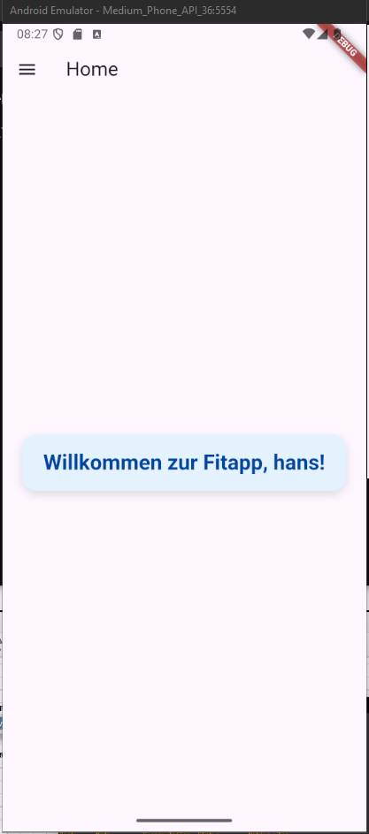
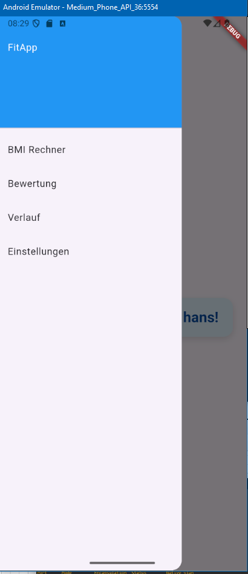
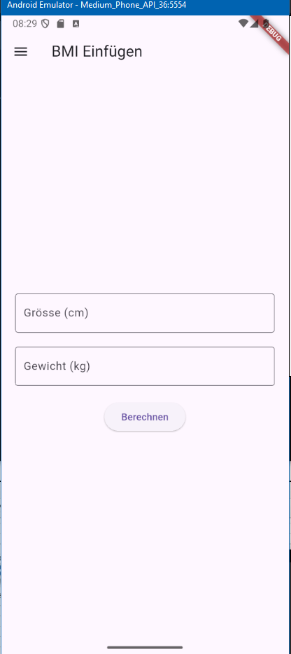
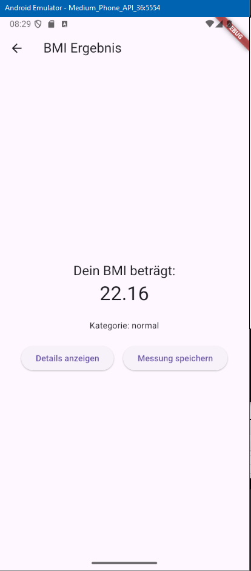
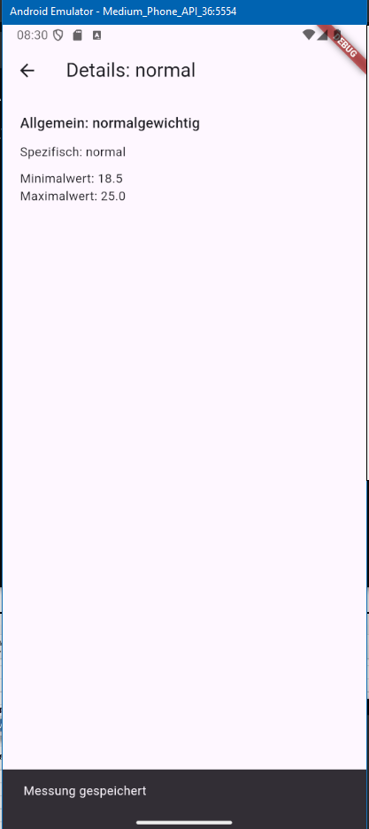
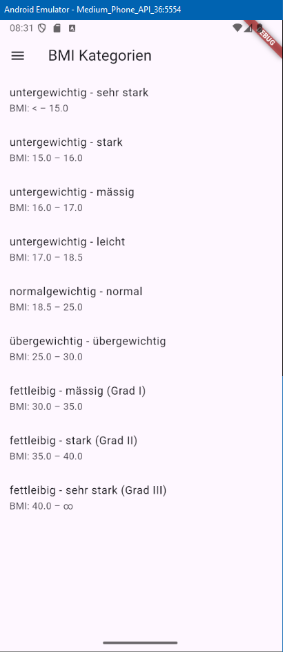
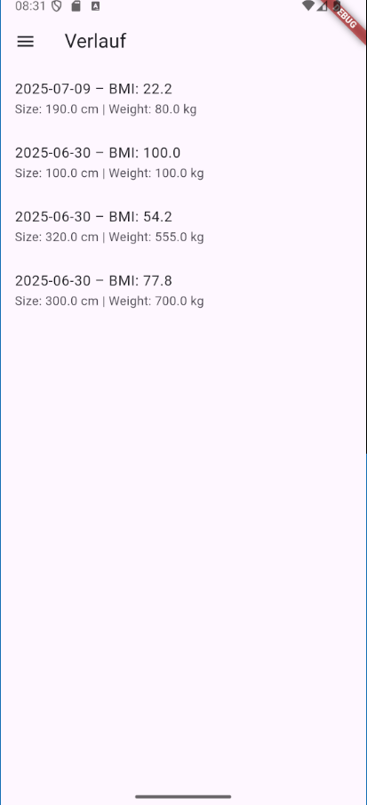
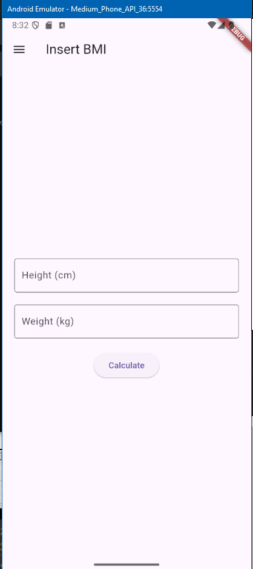

# FitApp

A multilingual BMI calculator app built with Flutter.

Home screen with personalized greeting based on selected user.$

## Overview

**FitApp** helps users:

- Calculate and categorize their **Body Mass Index (BMI)**
- Track BMI measurements over time
- Manage multiple user profiles
- View BMI rating categories and detailed explanations
- Supports in multiple languages (English and German)

## Features

- BMI calculation with height & weight inputs
- Dynamic classification using WHO BMI categories
- Local data persistence (SQLite) per user
- Multi-user support with persistent selection
- Clean and adaptive Material Design
- Full localization in German and English

## Technologies

- Flutter / Dart
- I10n
- SQL Lite

## Screenshots

### Menu

### Calculator entry page

### Calculator result page

### Category detail page

### Category overview page

### User based history page

### User settings

Here you can change or create a new user

### The whole app is multilingual

Currently Englisch and German is supported, based on the device Settings

